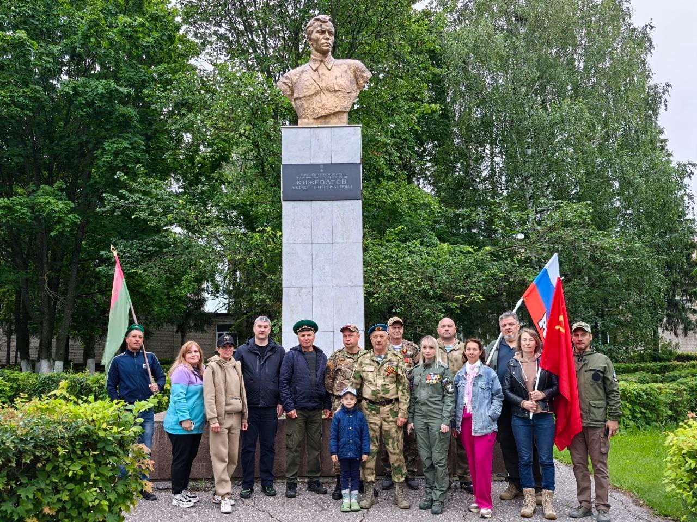

22 июня в 4 часа утра в Пензе состоялась акция «Свеча памяти», приуроченная к Дню памяти и скорби. По традиции акция прошла на трёх площадках: у Монумента воинской и трудовой Славы, памятного знака «Воин пограничник», а также в селе Кижеватово у памятника Герою Советского Союза А.М. Кижеватову.

В акции приняли участие представители ветеранских организаций Пензенской области, сотрудники Многофункционального молодежного центра, представители Молодёжного крыла Народного фронта, руководитель центра патриотического воспитания молодёжи Пензенской области «Парк Патриот» Марина Дулаева, руководитель Пензенского регионального отделения «БОЕВОГО БРАТСТВА» Юрий Краснов, руководитель военно-патриотического клуба «Витязи» села Чемодановка Виктор Оськин.

Собравшиеся почтили память погибших защитников Отечества минутой молчания, возложили цветы и зажгли свечи.

Оценили 12 человек
Показать список поделившихся
