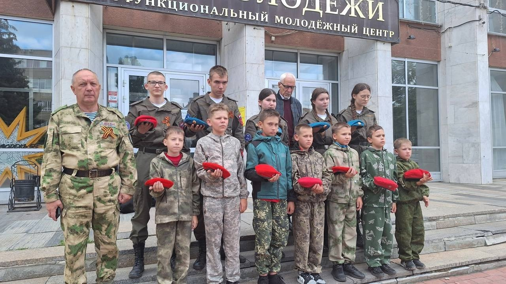

Ровно 84 года назад, 22 июня 1941 года, началась Великая Отечественная война – самая кровопролитная и страшная война в истории нашей страны, явившаяся основной частью Второй мировой войны.

В 12 часов 15 минут сотрудники Дома молодёжи Пензенской области и воспитанники военно-патриотического клуба «Витязи» присоединились к Всероссийской минуте молчания.

В центре Пензы раздался звук метронома, который призывал всех жителей города на минуту остановиться и вспомнить тех, благодаря которым мы живем в мирное время. Тех, которые истекая кровью, бились до последнего, чтобы не пропустить врага вглубь страны. Память об их подвиге будет жить вечно!
