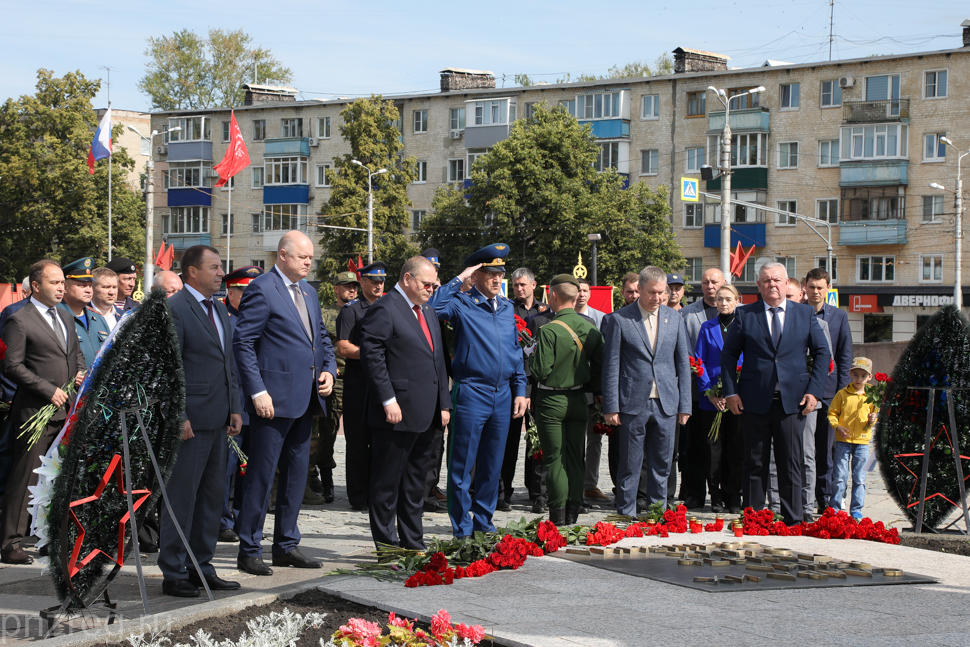

В памятном мероприятии также приняли участие депутаты Государственной Думы, Законодательного Собрания Пензенской области и Пензенской городской Думы, представители городского руководства, руководители правоохранительных структур, бойцы отряда «Тигр», представители ветеранских и молодежных общественных объединений, курсанты ПАИИ и кадеты.

Память жертв Великой Отечественной войны, павших на полях сражений и умерших от ран, погибших в плену, концентрационных лагерях и на оккупированных нацистами территориях, почтили минутой молчания, после чего к подножию монумента возложили венки и цветы.

За годы войны были мобилизованы и ушли добровольцами в действующую армию более 300 тысяч жителей Пензенской области, около 190 тысяч человек не вернулись домой.