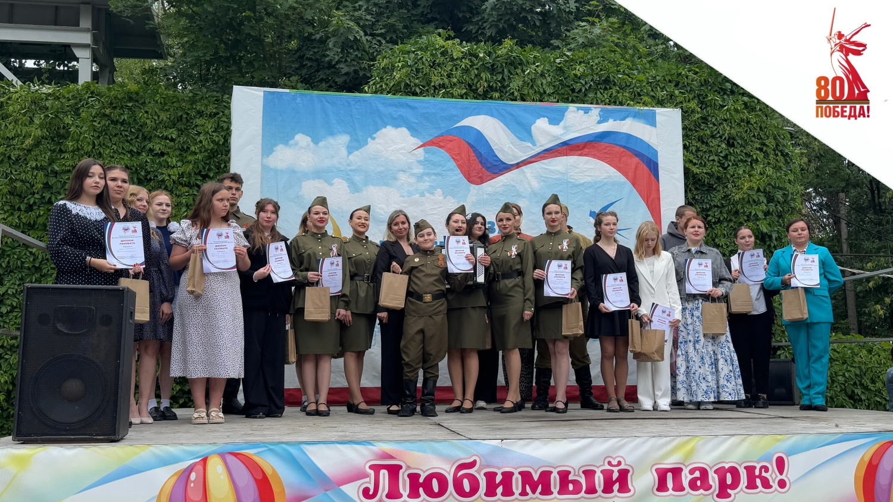

В Центральном парке культуры и отдыха им В.Г. Белинского в преддверии Дня памяти и скорби состоялся гала-концерт Областного молодежного фестиваля патриотической песни «Катюша».

В этом году фестиваль патриотической песни «Катюша» посвящен 80–ой годовщине Победы советского народа в Великой Отечественной войне и проводится в рамках реализации государственной программы Пензенской области «Молодежь Пензенской области».

С приветственным словом к гостям и участникам фестиваля обратился ветеран специальной военной операции, социальный координатор филиала фонда «Защитники Отечества» по Пензенской области, депутат Пензенской городской Думы 8 созыва Виктор Смоляков.

Он отметил важность патриотического воспитания среди молодёжи, формирование у молодежи активной гражданской позиции, уважительного отношения к своей стране, родной истории, культуре и традициям, гордости за свою малую Родину.

Фестиваль «Катюша» проходит в областном центре с 2006 года и ежегодно собирает самодеятельные творческие коллективы и исполнителей, авторов песен в возрасте от 14 до 30 лет со всех районов Пензенской области.

Программа гала-концерта включала в себя лучшие номера-победители по итогам отборочного (районного) этапа, по номинациям: «Сольные исполнители», «Вокальные коллективы» и «Авторы – исполнители».

Фотоотчет - по ссылке.