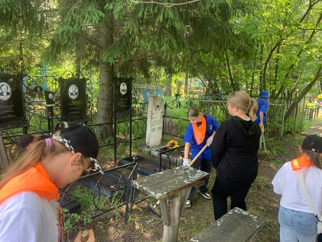

Воспитанники ДОЛ «Теремок» приняли участие школы привели в порядок могилы ветеранов и участников Великой Отечественной войны, убрали сухую опавшую листву и палки.
Ранее волонтерами было отмечено, что многие из захоронений и надгробий находятся в весьма плачевном и запущенном состоянии.
«Уборка памятных мест — это символ заботы о тех, кто ушел из жизни, и уважения к их памяти. Для нашей организации акция стала доброй традицией и выражением заботы о месте, где хранится память и история наших героев. С каждым годом на патриотические акции откликается как можно больше молодежи, что не может не радовать. Перед молодыми людьми сейчас стоит задача защитить историческую правду о Великой Отечественной войне и рассказать ее будущему поколению»