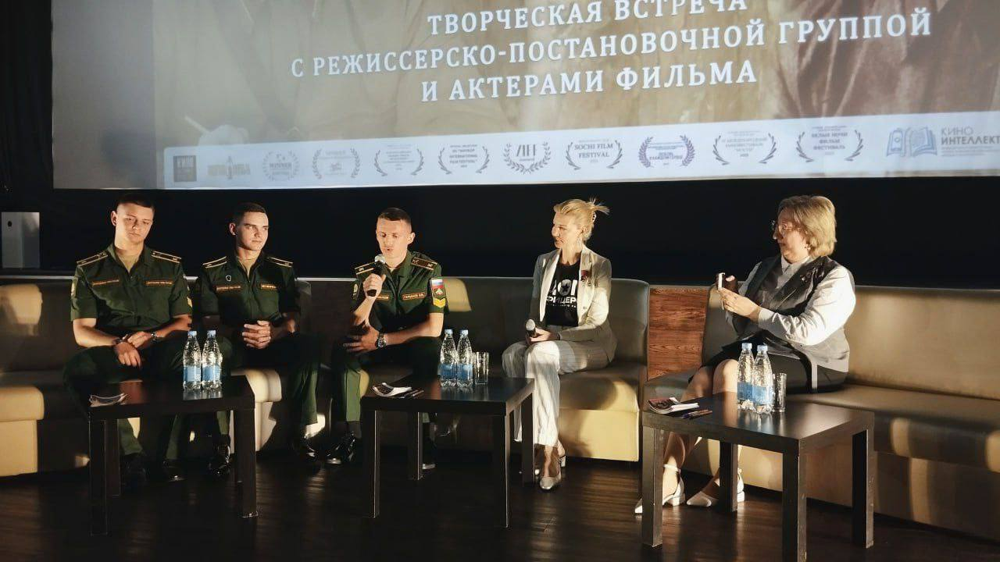

Российско-белорусский фильм «Приказано жить», созданный Центром культурного развития «Дом офицеров» совместно с белорусскими военно-историческими реконструкторами, посвящённый подвигу командира партизанского отряда Алексея Черткова, показали в кинотеатре «Мир» в Могилёве. Зрителями стали представители власти, создатели фильма, курсанты, а также родственники партизан и участники Великой Отечественной войны. 

В рамках визита в Беларусь творческая команда фильма провела ряд значимых встреч и мероприятий. Одним из ключевых событий стала творческая встреча с авторами и актёрами фильма. 
 
Также съемочная группа побывала на экскурсии на аэродроме Липки, которая была организованна при содействии главы администрации Николая Полякова. Участники ознакомились с работой аэродрома и его инфраструктурой, получив новые впечатления и полезный опыт.

Кинолента уже завоевала более десяти наград на российских и международных фестивалях и получила высокую оценку у зрителей. Фильм «Приказано жить» будет доступен к просмотру в кинотеатрах и кинозалах Могилёва и Могилёвской области в течение года.
