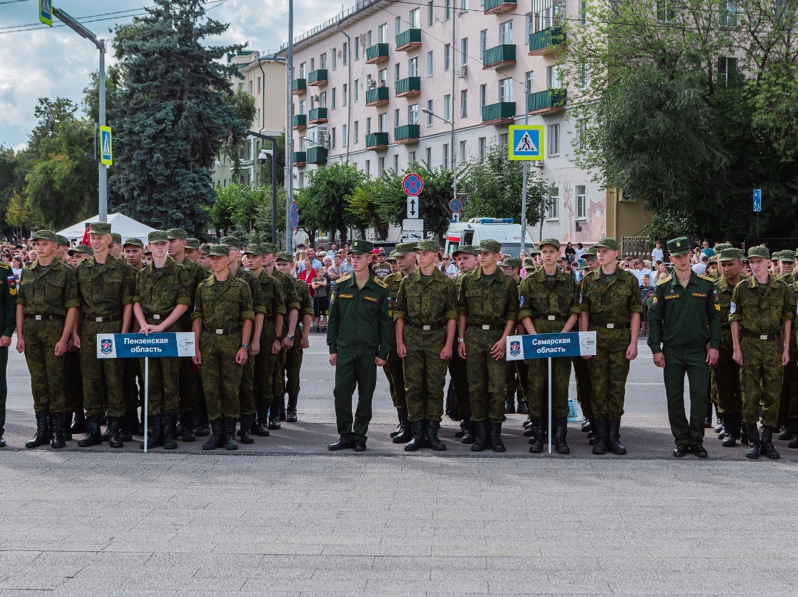

Сборы пройдут с 1 по 21 августа на базе Пензенского артиллерийского инженерного института имени генерала армии А. В. Хрулева. Здесь соберутся более 300 будущих защитников Родины.

В событии примут участие команды из всех 14 регионов ПФО, сформированные по результатам предварительного отбора. Также планируется участие команд из Донецкой Народной Республики, Луганской Народной Республики, Запорожской области и Республики Беларусь.

Как отмечал губернатор Пензенской области Олег Мельниченко, проект зарекомендовал себя как хороший инструмент для подготовки молодежи к службе в вооруженных силах, стал своеобразной кузницей кадров для армии, органов МВД, ФСБ, МЧС, Росгвардии.

На сборах гвардейцы погрузятся в условия, приближенные к армейским. Юноши займутся физической, строевой, огневой подготовкой (с полевым выходом), научатся современной тактике и методам ведения военных действий, улучшат знания по истории Отечества, узнают об основах управления БПЛА, встретятся с ветеранами боевых действий, продемонстрируют силу и выносливость в спортивных и военно-прикладных дисциплинах, а также проявят свои творческие способности. Впервые в Год защитника Отечества пройдут мастер-классы и соревнования по гиревому виду спорта. Гвардейцы совместно сделают 1418 подъемов гирь – в память о каждом дне Великой Отечественной Войны.

Напомним, уникальный военно-патриотический проект «Гвардеец» реализуется с 2013 года по инициативе и под патронажем полномочного представителя Президента РФ в ПФО. Губернатор Пензенской области Олег Мельниченко стоял у истоков «Гвардейца». В 2013 году он работал в аппарате полномочного представителя Президента РФ в ПФО и занимался, в том числе разработкой этого проекта. Изначально сборы проводились на территории Нижегородской и Пензенской областей. С 2022 года полномочным представителем Президента РФ в ПФО Игорем Комаровым было принято решение доверить проведение общественно значимого проекта «Гвардеец» Пензенской области.