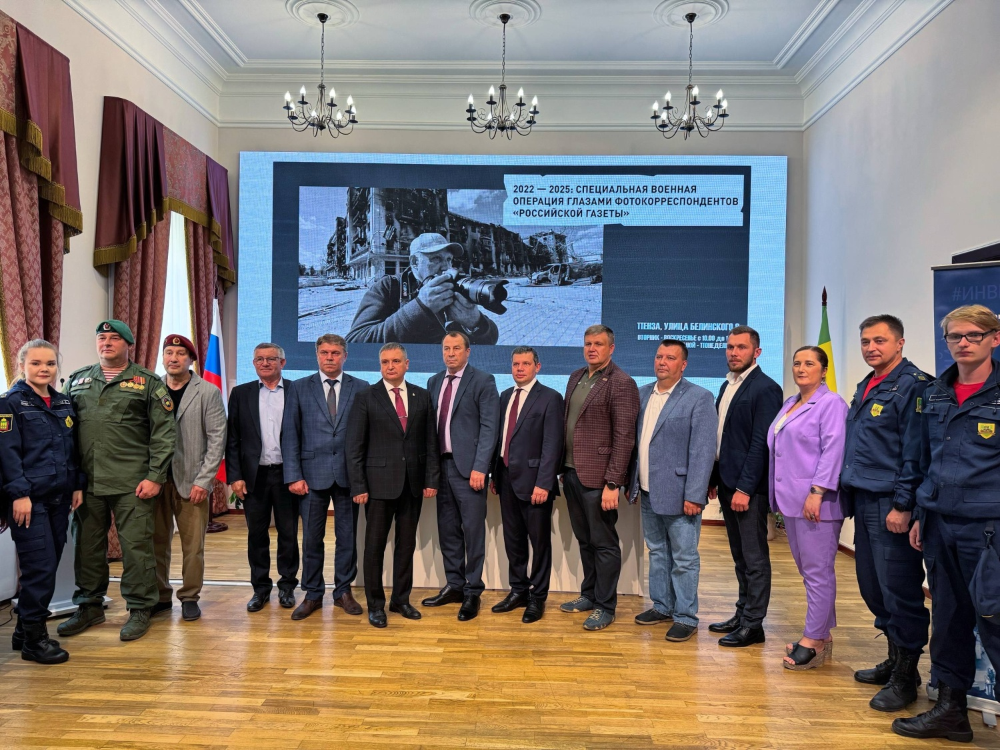

Экспозиция действует в Пензенском краеведческом музее. Проект представляет собой уникальную хронику событий, происходящих в зоне проведения СВО. Через объектив фотокорреспондентов «Российской газеты» можно увидеть портрет героизма, мужества и самоотверженности солдат, добровольцев и гражданского населения.

Фотографии военкора запечатлели не только боевые действия, но и повседневную жизнь на освобожденных территориях, восстановление инфраструктуры, работу медиков и волонтеров.

«Выставка – не просто собрание фотографий, это огромная работа, отражающая серьезные события, которые изменили не только судьбы людей, но и в корне трансформировали нашу страну», – поделился своими впечатлениями первый заместитель председателя регионального правительства Владимир Щекин.

Директор пензенского филиала Общества «Знание» Андрей Грачев также высоко оценил экспозицию.

«Фотография – важный инструмент коммуникации. За каждым кадром военного корреспондента – реальные люди и судьбы», – констатировал он.

Посетителям представлены профессиональные фотоработы высокой художественной и документальной ценности. Они сопровождены авторскими комментариями и цитатами из репортажей корреспондентов, находившихся в непосредственной близости от событий. По словам первых зрителей, каждый снимок передает напряженность момента, стремление к жизни и победе, демонстрирует важность сохранения правды о происходящем – через честный взгляд очевидца и профессиональное освещение событий.