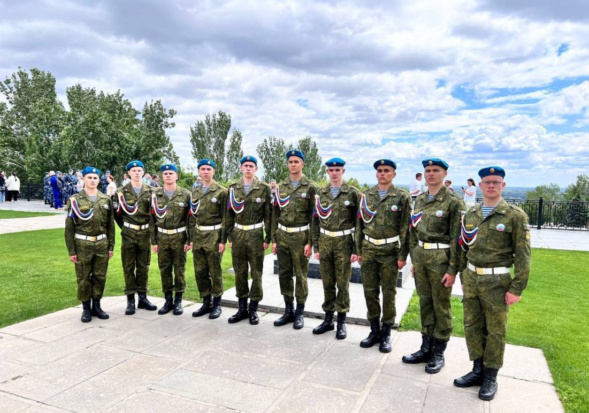

Состязания проходят в Волгограде. Спортивные мероприятия направлены на реализацию государственной программы «Развитие физической культуры и спорта» и объединили более 660 юношей со всех регионов страны.

«В программу соревнований включены дисциплины, способствующие физической и военно-прикладной подготовке: бег на 60 метров и 3 километра, прыжки в длину, подтягивание, метание спортивного снаряда, стрельба из пневматической винтовки, плавание, а также неполная разборка и сборка автоматов Калашникова АК-74», — проинформировал руководитель команды Алексей Юдин.

Пензенскую область представляет сборная команда в составе: Дмитрия Голышева (г. Кузнецк), Артема Сазонова (г. Кузнецк), Арсения Максимова (г. Кузнецк), Владислава Галкина (г. Кузнецк), Степана Судакова (г. Кузнецк), Владимира Стрелкова (Пачелмский район), Максима Папшева (Пачелмский район), Дмитрия Пивикова (Пачелмский район), Алексея Жаркова (г. Сердобск), Сергея Шишкина (г. Сердобск), Дмитрия Кузнецова (г. Сердобск), Сергея Шишкова (Бековский район), Ивана Зайцева (Лопатинский район).