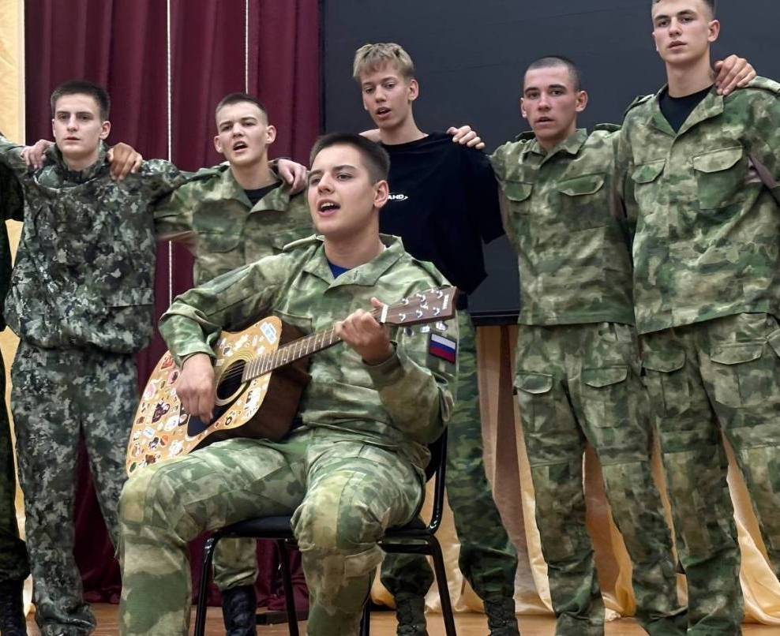

С 30 по 4 июля на базе Пензенского агропромышленного колледжа состоялись военно-спортивные патриотические сборы «5 дней в армии». В сборах приняли участие 40 учащихся 9-10 классов общеобразовательных организаций, кадетских школ, а также воспитанники военно-патриотических молодежных объединений.

Цель сборов – отбор юношей в команду Пензенской области для участия в юнармейских военно-патриотических сборах «Гвардеец» Приволжского федерального округа, которые будут проводиться на базе Пензенского артиллеристского инженерного института в августе.

В течение пяти дней юноши со всех уголков Пензенской области под руководством опытных инструкторов из числа сотрудников Регионального центра военно-патриотического воспитания и подготовки молодежи к военной службе и военнослужащих Пензенского артиллеристского инженерного института проходили испытания на прочность.

В программу сборов вошли строевая, общефизическая, огневая подготовка, спортивное ориентирование на местности, метание гранат на дальность, дартс, занятия по гиревому виду спорта, прохождение полосы препятствий, а также мероприятия направленные на сплочение будущей команды.

По итогам сборов сформирован взвод из 20 человек, который представит Пензенскую область на юнармейских военно-патриотических сборах «Гвардеец-2025». Напомним, что «Гвардеец» входит в состав общественных проектов ПФО и реализуется под патронажем полномочного представителя Президента РФ в ПФО Игоря Комарова.