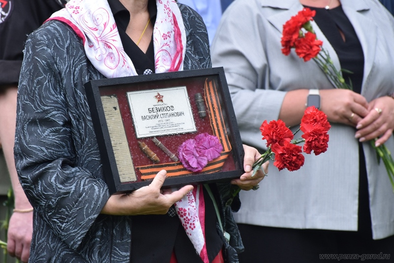

5 июля на Мироносицком кладбище города Пензы состоялась церемония захоронения останков рядового бойца Красной армии Василия Степановича Безикова. Уроженец Пензенской области Башмаковского района села Колесовка погиб в бою в сентябре 1942 года.

В траурной процессии приняли участие представители областной и городской власти, общественных и ветеранских организаций, поискового движения, кадеты и юнармейцы пензенских школ.

«Благодаря кропотливой, тяжелой работе поисковиков Василий Степанович вернулся в родной пензенский край, который всегда гордился своими героями», — отметил глава Пензы Олег Денисов.

Также градоначальник добавил, что в настоящее время наша страна переживает непростой период.

«Мы верим, что те бойцы, которые сейчас защищают исторические рубежи, возвратятся домой живыми и здоровыми», — подчеркнул он.

Останки Василия Степановича были обнаружены в ходе проведения весеннего этапа «Вахты памяти» 2025 года в Зубцовском районе Тверской области поисковой командой «Газпром» города Москвы, под руководством командира поискового отряда «Пионер» Михаила Богданова.

Бойца захоронили под гимн России и оружейные залпы, затем присутствующие возложили цветы к могиле Василия Безикова.

Завершилось мероприятие строевым прохождением курсантов филиала Военной академии материально-технического обеспечения имени генерала армии А.В. Хрулёва под марш «Прощание славянки».

Василий Степанович в годы войны служил в воинской части № 921 артиллерийского полка 354 Стрелковой дивизии. В сентябре 1942 года был убит в ходе ожесточенных боев с немцами в Тверской области.