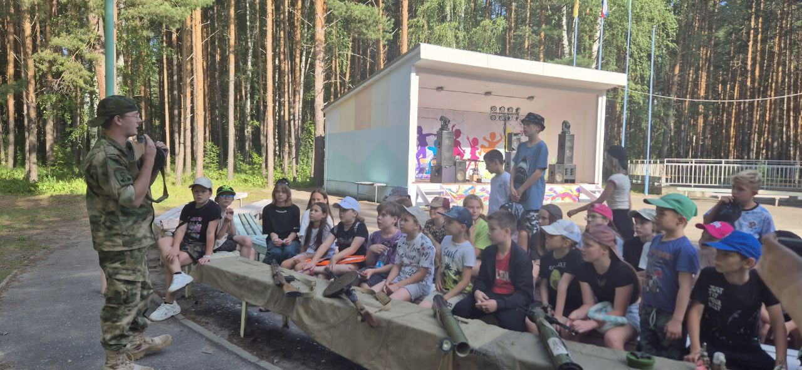

7 июля сотрудниками Ассоциации школьных музеев Пензенской области и Региональным центром военно-патриотического воспитания и подготовки молодежи к военной службе ГАУ ПО «ММЦ»  были организованы выезды в ДОЦ "Белка" и ДОЛ "Звездочка". 

Воспитаноикам были прведены выставка оружия времен Великой Отечественной войны и военно- патриотический квест "Воля к Победе".

Среди экспонатов выставки – макеты используемого боевого оружия и снарядов.
Выставки не ограничиваются только историей: школьники также знакомятся с современными образцами оружия и приспособлениями для ведения боевых действий, которые используются в условиях специальной военной операции. 

В квесте задания были направлены на игровое изучение истории Великой Отечественной войны и сплочение коллектива.

Отдыхающие испытали яркие эмоции и получили незабываемые впечатления.