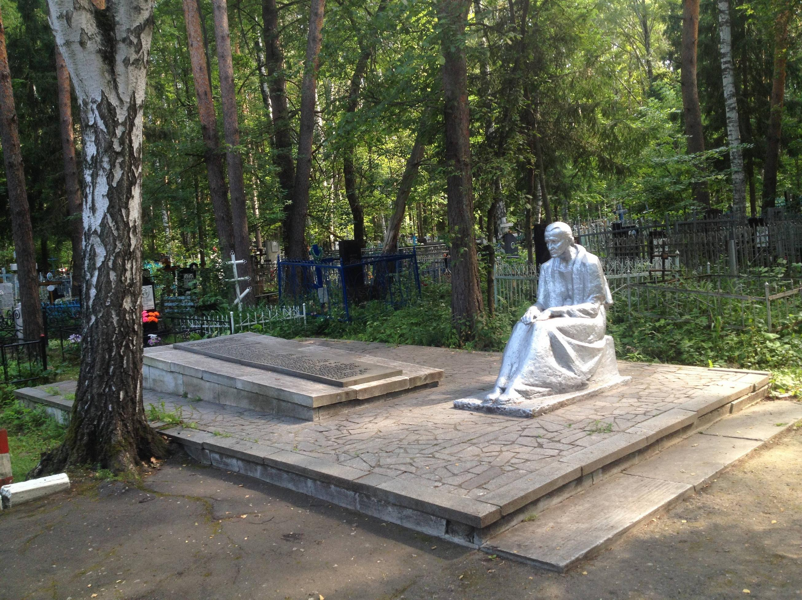

В поселке Ахуны, на Ахунском кладбище, находятся братские захоронения участников Великой Отечественной войны. В частности, там расположено захоронение "Скорбящая мать", а также захоронения, связанные с бывшим эвакогоспиталем №2772. 

Ахунское кладбище:
Расположено в посёлке Ахуны, на улице Кордон Студёный. 

Братские захоронения:
На кладбище есть братские могилы, где хоронили погибших воинов Великой Отечественной войны. 

Эвакогоспиталь №2772:
Корпуса госпиталя находились на территории Ахун, где лечили раненых солдат и работали врачи, борющиеся за их жизни. 

"Скорбящая мать":
Это название одного из мемориалов на Ахунском кладбище, посвящённого советским воинам. 

Номер захоронения в ВМЦ 58-94/2014

Вид захоронения братская могила

Состояние захоронения хорошее

Количество могил 1

Захоронено всего 42

Захоронено известных 42

Захоронено неизвестных 0

Кто шефствует над захоронением Пензенская государственная сельскохозяйственная академия