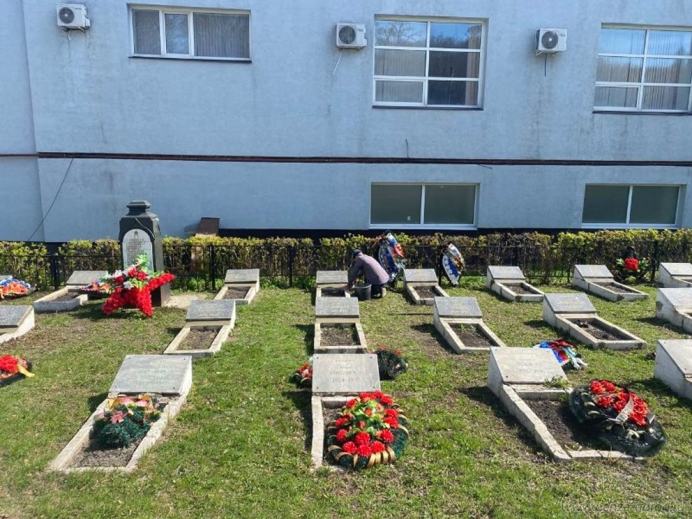

Братское кладбище советских воинов, умерших от ран в годы Великой Отечественной войны

Регион захоронения Пензенская обл.

Номер захоронения в ВМЦ 58-71

Место захоронения г. Пенза, ул. Захарова, Мироносицкое кладбище, в. участок

Дата создания современного места захоронения __.__.1941

Дата последнего захоронения __.__.1945

Вид захоронения братские могилы

Состояние захоронения хорошее

Количество могил 6

Захоронено всего 648

Захоронено известных 648

Захоронено неизвестных 0

Кто шефствует над захоронением Пензенское отделение Самарской ж/д; з-д "Пензремдеталь"; Пензенский ГПИ; з-д "ВЭМ".