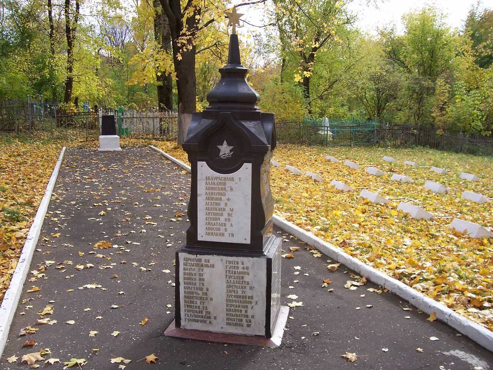

Митрофановское (Митрофаньевское) кладбище — кладбище в г. Пензе, одно из старейших городских кладбищ.

Открыто в 1796 году за городской чертой, близ Саратовской дороги, в связи с закрытием старого Вознесенского кладбища. Ныне располагается в жилом микрорайоне города. Ограничено улицами Водопьянова, Овражной, Новотамбовской и Березовским переулком. Центральный вход на кладбище расположен на улице Водопьянова.

Кладбище предназначалось для захоронения умерших городских обывателей Пензы: ремесленников, чиновников, дворян, мещан, крестьян. Эстетический облик кладбища отличался скромностью и аскетизмом, преобладали рядовые надгробия в виде крестов, плит, колонн, пирамид, обелисков.

Справа от центрального входа на кладбище расположены братские захоронения воинов, умерших от ран в годы Великой Отечественной войны в пензенских госпиталях.